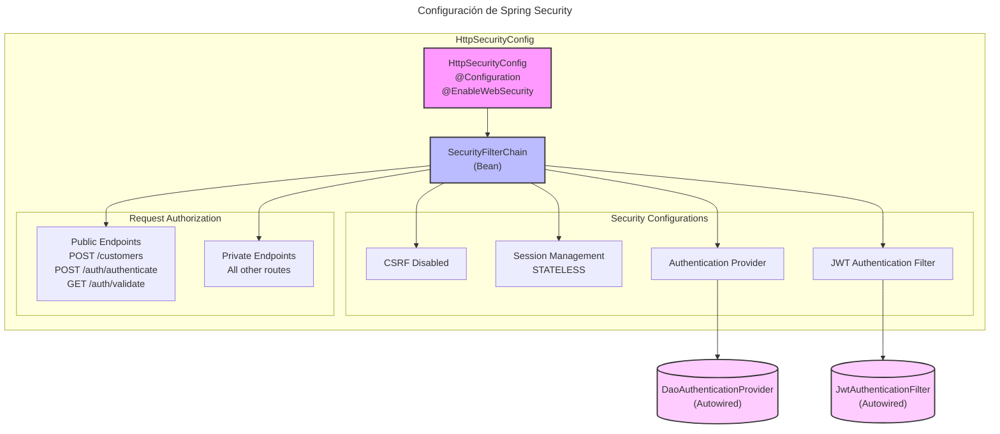
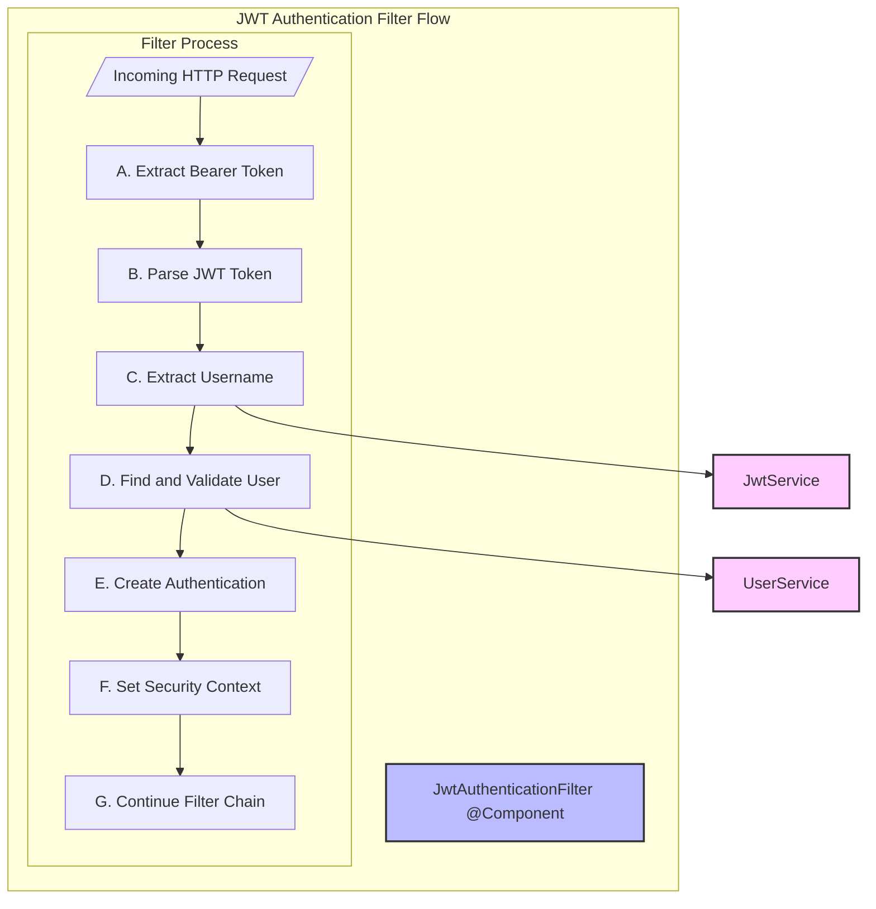
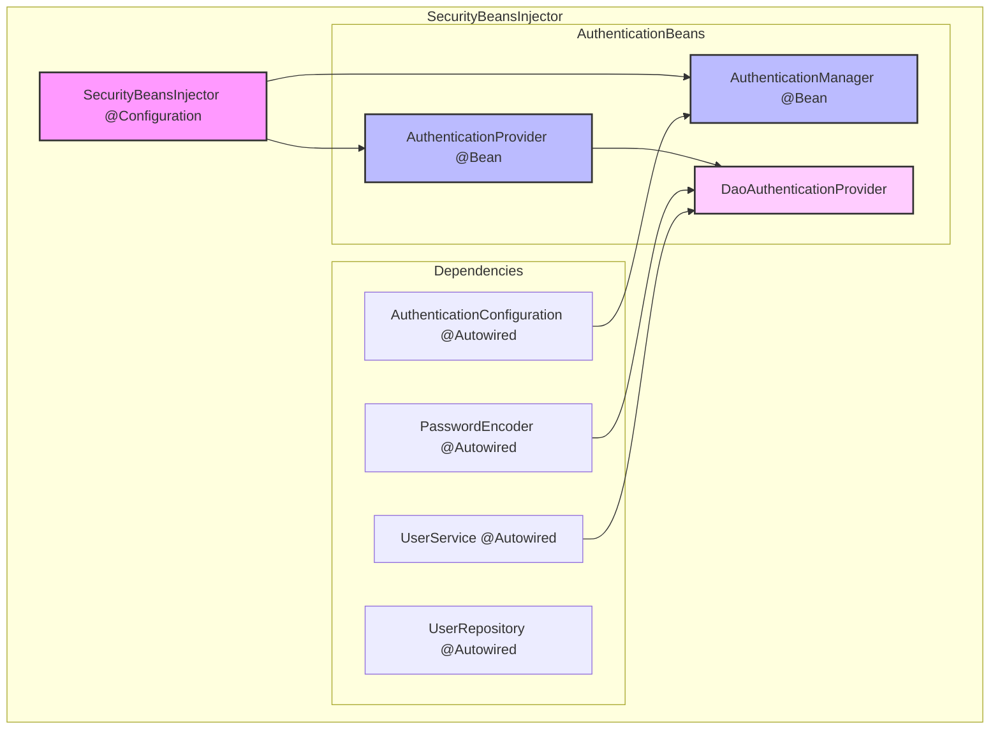

# Spring Security Configuration Diagram

## Descripción del Diagrama

El diagrama muestra la configuración principal de Spring Security con los siguientes componentes:

### Componentes Principales
1. **HttpSecurityConfig**: Clase de configuración principal
2. **SecurityFilterChain**: Bean que configura la cadena de filtros

### Configuraciones de Seguridad
- CSRF deshabilitado
- Manejo de sesión STATELESS
- Proveedor de autenticación
- Filtro JWT

### Autorización de Peticiones
- **Endpoints Públicos**:
    - POST /customers
    - POST /auth/authenticate
    - GET /auth/validate
- **Endpoints Privados**: Todas las demás rutas

### Componentes Externos
- DaoAuthenticationProvider (Autowired)
- JwtAuthenticationFilter (Autowired)

# Diagrama de Flujo del Filtro JWT

## Descripción del Flujo

### Componente Principal
- **JwtAuthenticationFilter**: Filtro que procesa y valida los tokens JWT

### Proceso de Filtrado
A. **Recepción de Request**: Intercepta la petición HTTP entrante 

B. **Extracción de Token**: Obtiene el token Bearer del header Authorization

C. **Parsing de JWT**: Procesa el token JWT

D. **Extracción de Username**: Obtiene el username del token

E. **Validación de Usuario**: Busca y valida el usuario en el sistema

F. **Creación de Autenticación**: Genera el objeto de autenticación

G. **Configuración de Contexto**: Establece la autenticación en el SecurityContext

### Servicios Relacionados
- **JwtService**: Manejo y procesamiento de tokens JWT
- **UserService**: Gestión y validación de usuarios

### Notas Técnicas
- El filtro se ejecuta una vez por cada request
- Hereda de OncePerRequestFilter
- Integrado en la cadena de filtros de Spring Security

# Diagrama de Inyección de Beans de Seguridad 

#  Descripción del Diagrama
### Componentes Principales

1. SecurityBeansInjector: Clase de configuración principal con @Configuration
2. DaoAuthenticationProvider: Implementación del AuthenticationProvider

## Beans Configurados
1. AuthenticationManager: Gestiona el proceso de autenticación
1. AuthenticationProvider: Define la estrategia de autenticación

### Dependencias Autowired
1. PasswordEncoder: Manejo de encriptación de contraseñas
2. UserRepository: Acceso a datos de usuarios
3. UserService: Servicio de usuarios con UserDetailsService

### AuthenticationConfiguration: Configuración base de autenticación

### Flujo de Trabajo
SecurityBeansInjector configura los beans necesarios
AuthenticationManager se obtiene de AuthenticationConfiguration
DaoAuthenticationProvider usa UserService y PasswordEncoder
UserService implementa la carga de usuarios

### Notas Técnicas
La configuración es stateless
Se utiliza JWT para la gestión de tokens
Integración completa con Spring Security
Manejo automático de la cadena de autenticación