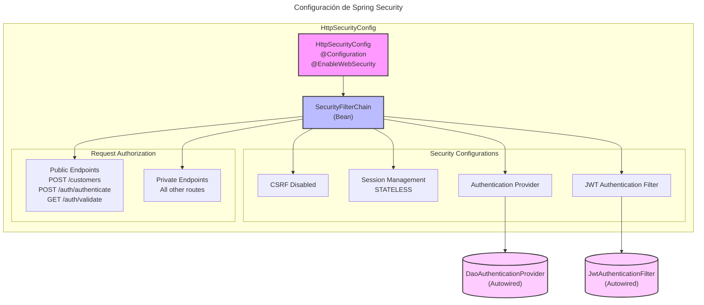

# Spring Security Configuration Diagram

## Descripción del Diagrama

El diagrama muestra la configuración principal de Spring Security con los siguientes componentes:

### Componentes Principales
1. **HttpSecurityConfig**: Clase de configuración principal
2. **SecurityFilterChain**: Bean que configura la cadena de filtros

### Configuraciones de Seguridad
- CSRF deshabilitado
- Manejo de sesión STATELESS
- Proveedor de autenticación
- Filtro JWT

### Autorización de Peticiones
- **Endpoints Públicos**:
    - POST /customers
    - POST /auth/authenticate
    - GET /auth/validate
- **Endpoints Privados**: Todas las demás rutas

### Componentes Externos
- DaoAuthenticationProvider (Autowired)
- JwtAuthenticationFilter (Autowired)